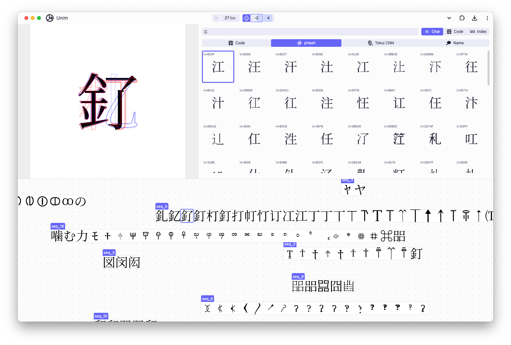

<div align="center">
  
  <h1>Unim</h1>
  
	<div>
		<strong><a href="https://baku89.github.io/unim/">💥 Live Demo 💥</a></strong>
	</div>
	<br>
</div>

## Development

```bash
git clone --recursive https://github.com/baku89/unim
yarn install
yarn dev
```
